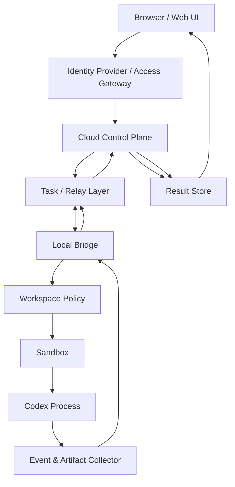

# Cloud-to-Local Codex Bridge


云端发任务，本地 Codex 执行，结果回写云端。  
Route tasks from a private cloud UI to a local Codex CLI runner, then send logs and results back to the cloud.

展开对应语言即可在当前页面阅读说明。

<details open>
<summary><strong>中文说明</strong></summary>

## 这是什么

**Cloud-to-Local Codex Bridge** 是一份 concept / architecture note，用来描述如何把私有云端页面里的任务安全地交给本地 Codex CLI runner 执行。

它描述的是一种私有、自托管的执行模式：

```text
Web UI
  -> Cloud Control Plane
  -> Task / Relay Layer
  -> Local Bridge
  -> Local Codex Runtime
  -> Result Store
  -> Web UI
```

云端侧是 control plane：负责身份、任务创建、状态、日志和结果展示。本地侧是 execution plane：本地 bridge 接收任务、校验策略、在允许列表 workspace 里启动 Codex，并把结果回传云端。

核心原则：**云端可以请求执行任务，但本地 bridge 必须决定什么任务允许执行。**

## 这不是什么

- 不是 public API proxy。
- 不是 account sharing 方案。
- 不是绕过 usage limits、billing systems、rate limits 或 safety mechanisms 的方法。
- 不是 OpenAI 官方项目，也不是 OpenAI policy interpretation。

它描述的是单用户、私有、自托管的 runner pattern：用户远程控制自己的本地机器。

## 30 秒理解

常见云端 AI app 大致是：

```text
browser -> cloud API -> model service -> browser
```

这个模式是：

```text
browser -> cloud control plane -> local bridge -> local Codex process -> cloud result view
```

关键点：

- Browser 不运行 Codex。
- Cloud control plane 不直接进入本地机器。
- Local bridge 主动连出、校验任务、在受控 workspace 中运行 Codex，并回传 logs/results。

## Architecture Overview

从上往下读这张图：任务从 browser 开始，经过 cloud control plane，被 local bridge 领取，在本地 workspace 中运行，然后回到云端结果页。



## Scope And Boundaries

适合：

- 个人私有系统。
- 单用户控制自己的本地开发 workspace。
- 云端 UI 启动本地 Codex 任务，同时不暴露本地公网端口。
- 部署在 Cloudflare、Vercel、Supabase、AWS、GCP、Azure、VPS 或自建 backend 上。
- 执行受 workspace policy、sandbox、approval、timeout、output limits 和 audit logs 约束。

不适合：

- 公开多用户访问。
- 多人共享一个个人 Codex 或 ChatGPT 登录态。
- 把个人订阅包装成 public API。
- 从网页向本地机器透传任意 shell commands。
- 让 Codex 默认访问整个用户目录、SSH keys、browser cookies、cloud credentials、`.env` files 或 token caches。

## Platform-Agnostic Mapping

Cloudflare 是一种实现选项，不是要求。同一组职责也可以映射到其他平台。

| Responsibility | Generic Component | Example Implementations |
| --- | --- | --- |
| Identity | IdP / access gateway | Cloudflare Access, Auth0, Clerk, Supabase Auth, GitHub OAuth |
| Web UI | Frontend hosting | Cloudflare Pages, Vercel, Netlify, static hosting |
| Control plane | API / backend | Cloudflare Worker, Next.js API routes, FastAPI, Express, Lambda, Cloud Run |
| Task coordination | Queue / state store | Durable Objects, Redis, Postgres, SQS, Pub/Sub, RabbitMQ |
| Relay / transport | Polling, WebSocket, SSE, tunnel, mesh network | WebSocket server, Tailscale, SSH reverse tunnel, VPS relay |
| Result storage | Database / object storage | Postgres, SQLite, Supabase, D1, S3, R2, MinIO |

## Minimal Viable Flow

第一版不需要完整的 interactive runtime。最小版本可以用 signed polling 和 `codex exec`：

```text
1. Cloud UI creates a task
2. Cloud API stores the task as pending
3. Local bridge polls for pending work
4. Local bridge verifies signature, expiry, nonce, workspace, and risk policy
5. Local bridge runs codex exec in an allowlisted workspace
6. Local bridge redacts/truncates logs and uploads events
7. Cloud UI displays completed or failed status
```

即使是私有 PoC，也应该包含：

- `task_id`, `nonce`, `expires_at`
- workspace allowlist
- sandbox enabled by default
- output-size limit
- timeout and cancellation
- log redaction
- replay protection
- auditable task state

## Roadmap

**Phase 1: signed polling + `codex exec`**  
跑通最小安全闭环：创建任务，本地 bridge 领取任务，本地 Codex 执行，结果返回云端。

**Phase 2: real-time events + cancellable execution**  
加入 live logs、ordered events、timeout handling、cancellation 和 idempotent result updates。

**Phase 3: approvals + artifacts + audit**  
加入高风险操作审批，保存 diff、reports 等 artifacts，做 log redaction，并保留完整 audit trail。

**Phase 4: session runtime**  
探索 `codex app-server`、多 workspace policy、更丰富的交互和 long-lived sessions。

## Security Boundaries

Cloud side 不应该被 local bridge 盲信。云端可以提交 task request，但本地执行必须由本地策略治理。

必要 guardrails：

- 不上传本地 auth files，例如 `~/.codex/auth.json`、API keys、SSH keys、browser cookies、cloud credentials、`.env` files 或 token caches。
- 不把 local bridge 直接暴露到公网。
- 不允许网页透传任意 shell command。
- 默认不使用 full user-directory access。
- 不多人共享个人 Codex login session。
- 本地策略必须留在本地：workspace allowlists、risk rules、approval decisions 都必须由 bridge 强制执行。
- 只保存必要任务数据，敏感 logs 上传前先 redaction。

完整威胁模型见 [SECURITY.md](SECURITY.md)。

## Repository Status

Status: **concept / architecture note**

Runnable code: **not yet**

Primary output:

- architecture overview
- security boundaries
- platform mapping
- MVP roadmap
- implementation notes

## Repository Structure

```text
README.md              # 同页中英文说明
docs/architecture.md   # 完整架构说明，目前为中文长文
SECURITY.md            # Threat model and security checklist
DISCLAIMER.md          # Scope and usage disclaimer
CONTRIBUTING.md        # Contribution guidelines
.gitignore
```

## How To Read

- 快速理解：读当前 README。
- 完整长文：读 [docs/architecture.md](docs/architecture.md)。
- 做 PoC 之前：读 [SECURITY.md](SECURITY.md)。
- 面向团队、公开用户或商业服务前：读 [DISCLAIMER.md](DISCLAIMER.md)。
- 提 issue 或改文档前：读 [CONTRIBUTING.md](CONTRIBUTING.md)。

</details>

<details>
<summary><strong>English README</strong></summary>

## What It Is

**Cloud-to-Local Codex Bridge** is a concept and architecture note for safely routing tasks from a private cloud UI to a local Codex CLI runner.

It describes a private, self-hosted execution pattern:

```text
Web UI
  -> Cloud Control Plane
  -> Task / Relay Layer
  -> Local Bridge
  -> Local Codex Runtime
  -> Result Store
  -> Web UI
```

The cloud side is the control plane: identity, task creation, state, logs, and result display. The local side is the execution plane: a local bridge receives tasks, validates policy, starts Codex in an allowlisted workspace, and sends results back.

The core idea is simple: **the cloud can request work, but the local bridge decides what is allowed to execute.**

## What It Is Not

- It is not a public API proxy.
- It is not intended for account sharing.
- It is not a way to bypass usage limits, billing systems, rate limits, or safety mechanisms.
- It is not an official OpenAI project or policy interpretation.

It is a private self-hosted runner pattern for a single user controlling their own local machine.

## 30-Second Model

Most cloud AI apps look like this:

```text
browser -> cloud API -> model service -> browser
```

This pattern looks like this:

```text
browser -> cloud control plane -> local bridge -> local Codex process -> cloud result view
```

Key points:

- The browser does not run Codex.
- The cloud control plane does not directly enter the local machine.
- The local bridge connects outward, validates the task, runs Codex in a controlled workspace, and returns logs/results.

## Architecture Overview

Read the diagram from top to bottom. A task starts in the browser, moves through the cloud control plane, is picked up by the local bridge, runs in a local workspace, then returns to the cloud result view.


## Scope And Boundaries

This architecture is suitable for:

- Private personal systems.
- A single user controlling their own local development workspace.
- A cloud UI that starts local Codex tasks without exposing a local public port.
- Platform-agnostic deployments on Cloudflare, Vercel, Supabase, AWS, GCP, Azure, a VPS, or a custom backend.
- Systems where execution is constrained by workspace policy, sandboxing, approval, timeout, output limits, and audit logs.

This architecture is not suitable for:

- Public multi-user access.
- Sharing one personal Codex or ChatGPT login across users.
- Reselling or wrapping a personal subscription as a public API.
- Passing arbitrary shell commands from a web page to a local machine.
- Letting Codex access the entire user directory, SSH keys, browser cookies, cloud credentials, `.env` files, or token caches by default.

## Platform-Agnostic Mapping

Cloudflare is one possible implementation, not a requirement. The same responsibilities can be mapped to many platforms.

| Responsibility | Generic Component | Example Implementations |
| --- | --- | --- |
| Identity | IdP / access gateway | Cloudflare Access, Auth0, Clerk, Supabase Auth, GitHub OAuth |
| Web UI | Frontend hosting | Cloudflare Pages, Vercel, Netlify, static hosting |
| Control plane | API / backend | Cloudflare Worker, Next.js API routes, FastAPI, Express, Lambda, Cloud Run |
| Task coordination | Queue / state store | Durable Objects, Redis, Postgres, SQS, Pub/Sub, RabbitMQ |
| Relay / transport | Polling, WebSocket, SSE, tunnel, mesh network | WebSocket server, Tailscale, SSH reverse tunnel, VPS relay |
| Result storage | Database / object storage | Postgres, SQLite, Supabase, D1, S3, R2, MinIO |

## Minimal Viable Flow

The first prototype does not need a full interactive runtime. A minimal version can use signed polling and `codex exec`:

```text
1. Cloud UI creates a task
2. Cloud API stores the task as pending
3. Local bridge polls for pending work
4. Local bridge verifies signature, expiry, nonce, workspace, and risk policy
5. Local bridge runs codex exec in an allowlisted workspace
6. Local bridge redacts/truncates logs and uploads events
7. Cloud UI displays completed or failed status
```

Even a private proof of concept should include:

- `task_id`, `nonce`, and `expires_at`
- workspace allowlist
- sandbox enabled by default
- output-size limit
- timeout and cancellation
- log redaction
- replay protection
- auditable task state

## Roadmap

**Phase 1: signed polling + `codex exec`**  
Build the smallest safe loop: create task, local bridge claims it, Codex runs locally, result returns to cloud.

**Phase 2: real-time events + cancellable execution**  
Add live logs, ordered events, timeout handling, cancellation, and idempotent result updates.

**Phase 3: approvals + artifacts + audit**  
Add human approval for risky operations, persist artifacts such as diffs and reports, redact logs, and keep a full audit trail.

**Phase 4: session runtime**  
Explore `codex app-server`, multi-workspace policies, richer interaction, and long-lived sessions.

## Security Boundaries

The cloud side should not be blindly trusted by the local bridge. The cloud can submit a task request, but local execution must remain locally governed.

Required guardrails:

- Do not upload local auth files such as `~/.codex/auth.json`, API keys, SSH keys, browser cookies, cloud credentials, `.env` files, or token caches.
- Do not expose the local bridge directly to the public internet.
- Do not allow arbitrary shell command passthrough from the web page.
- Do not run with full user-directory access by default.
- Do not share a personal Codex login session with other users.
- Keep local policy local: workspace allowlists, risk rules, and approval decisions must be enforced by the bridge.
- Store only the minimum task data needed, and redact sensitive logs before upload.

See [SECURITY.md](SECURITY.md) for the threat model and implementation checklist.

## Repository Status

Status: **concept / architecture note**

Runnable code: **not yet**

Primary output:

- architecture overview
- security boundaries
- platform mapping
- MVP roadmap
- implementation notes

## Repository Structure

```text
README.md              # Same-page Chinese and English README
docs/architecture.md   # Full architecture note, currently in Chinese
SECURITY.md            # Threat model and security checklist
DISCLAIMER.md          # Scope and usage disclaimer
CONTRIBUTING.md        # Contribution guidelines
.gitignore
```

## How To Read

- Quick overview: read this README.
- Full architecture note: read [docs/architecture.md](docs/architecture.md).
- Before building a PoC: read [SECURITY.md](SECURITY.md).
- Before adapting this for teams, public users, or commercial services: read [DISCLAIMER.md](DISCLAIMER.md).
- Before opening issues or proposing changes: read [CONTRIBUTING.md](CONTRIBUTING.md).

</details>

## References

Codex documentation:

- [Codex Authentication](https://developers.openai.com/codex/auth)
- [Codex Non-interactive Mode](https://developers.openai.com/codex/noninteractive)
- [Codex App Server](https://developers.openai.com/codex/app-server)

Policy and account-boundary references:

- [OpenAI Account Sharing Policy](https://help.openai.com/en/articles/10471989)
- [OpenAI Terms of Use](https://openai.com/policies/terms-of-use/)

Specific CLI flags and product behavior may change over time. Treat this repository as an architecture note, and use current official documentation for implementation details.
