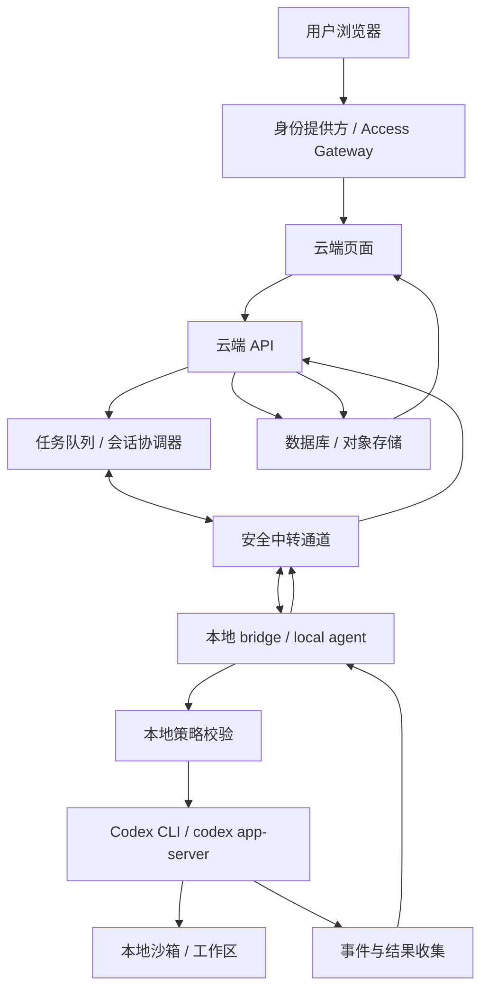

# Cloud-to-Local Codex Bridge

> 云端页面基于反向隧道的本地 Codex CLI 执行桥反馈云端

一个关于“云端控制、本地执行、结果回写”的私有自动化架构说明。

这个仓库记录一种 Cloud-to-Local 的执行桥构想：用户在私有云端页面输入任务，云端负责鉴权、排队、状态记录和结果展示；本地 bridge 主动连接云端，收到任务后调用本机 Codex CLI 或 `codex app-server` 执行，再把日志、状态、结构化输出和产物回写到云端数据库。

## 核心概念

这不是让云端网页直接运行 Codex，也不是把个人 Codex 登录态包装成公开 API。它更接近一种私有的 self-hosted runner：

```text
云端页面 -> 云端控制面 -> 安全中转通道 -> 本地 bridge -> 本地 Codex CLI -> 云端结果展示
```

对应英文概念：

**Remote Web UI to Local Codex CLI Execution Bridge via Reverse Tunnel**

对应中文技术名：

**基于反向隧道的本地 Codex CLI 执行桥：从云端页面到本地执行再回写云端**

## 为什么写这个

AI 开发工具正在进入一种混合架构：云端负责控制面、身份、任务状态和协作界面，本地负责文件系统、项目环境、命令执行和真实开发上下文。这个仓库把这个模式放到 Codex CLI 场景下拆开说明，重点讨论链路、边界、安全和 MVP 落地方式。

它适合：

- 个人私有系统。
- 单一账号远程控制自己的本地开发环境。
- 云端页面触发本地 Codex 执行分析、修复、生成报告等任务。
- 本地机器不暴露公网端口，由本地 bridge 主动连接云端。
- 使用 Cloudflare、Vercel、Supabase、AWS、GCP、Azure、自建 VPS 等任意云端控制面。

它不适合：

- 面向公众用户开放。
- 多人共享同一个个人 Codex 登录态。
- 把个人订阅包装成对外 AI API。
- 允许网页向本地机器透传任意 shell 命令。
- 让 Codex 默认访问整个用户目录、密钥、浏览器缓存或 SSH 凭据。

## 架构图



## 平台无关

这套架构不绑定 Cloudflare。Cloudflare Access、Workers、Durable Objects、D1、KV、R2 只是一组实现选项。其他平台也能承载同一套职责：

| 职责 | 通用组件 | 可选实现 |
| --- | --- | --- |
| 身份校验 | IdP / Access Gateway | Cloudflare Access、Auth0、Clerk、Supabase Auth、GitHub OAuth、自建登录 |
| 云端页面 | Web UI | Cloudflare Pages、Vercel、Netlify、自建 Nginx |
| 控制面 API | API / Serverless / Backend | Cloudflare Worker、Next.js API、FastAPI、Express、Lambda、Cloud Run |
| 任务协调 | Queue / Session Coordinator | Durable Objects、Redis、Postgres、SQS、Pub/Sub、RabbitMQ |
| 长连接中转 | Relay / WebSocket Server | Durable Objects、Fly.io、Railway、VPS、Tailscale、SSH reverse tunnel |
| 数据存储 | DB / Object Storage | D1、Postgres、SQLite、Supabase、S3、R2、MinIO |

## 文档

- [完整架构说明](docs/architecture.md)
- [安全边界](SECURITY.md)
- [免责声明](DISCLAIMER.md)

## MVP 路线

### Phase 1：签名轮询 + `codex exec`

跑通从云端页面创建任务，到本地 bridge 领取任务，再到 `codex exec --json` 执行并回写结果的最小闭环。

### Phase 2：WebSocket + 实时日志

让本地 bridge 常驻在线，云端即时下发任务，页面实时展示日志、状态和取消动作。

### Phase 3：`codex app-server` + 审批流 + artifacts

支持多轮交互、工具调用过程、人工审批、diff、截图、报告和结构化产物。

## What This Is Not

This project is not a public API proxy.

This project is not intended for account sharing.

This project is not a way to bypass usage limits.

This project is a private self-hosted runner pattern for a single user controlling their own local machine.

## 当前状态

这是一个 concept / architecture note，不是可直接安装运行的生产工具。后续可以继续补充：

- 平台实现示例，包括 Cloudflare Worker、Vercel、Supabase 和自建 VPS。
- 本地 bridge PoC。
- 消息协议草案。
- 任务状态机实现。
- 审批流示例。
- 日志脱敏策略。

## References

- Codex Authentication: https://developers.openai.com/codex/auth
- Codex Non-interactive Mode: https://developers.openai.com/codex/noninteractive
- Codex App Server: https://developers.openai.com/codex/app-server
- OpenAI Account Sharing Policy: https://help.openai.com/en/articles/10471989
- OpenAI Terms of Use: https://openai.com/policies/terms-of-use/
