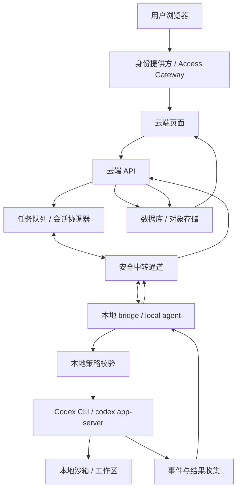

# Cloud-to-Local Codex Bridge

> 云端页面基于反向隧道的本地 Codex CLI 执行桥反馈云端

**Remote Web UI to Local Codex CLI Execution Bridge via Reverse Tunnel**

一个关于“云端控制、本地执行、结果回写”的私有自动化架构说明。它描述的不是一个已经发布的软件包，而是一种可实现的架构模式：云端页面负责输入、鉴权、排队和展示，本地 bridge 负责连接云端并调用本机 Codex CLI 或 `codex app-server`，最后把执行日志、状态和产物回写到云端。

## 30 秒理解

传统云端 AI 应用通常是：

```text
网页 -> 云端 API -> 模型服务 -> 网页显示结果
```

这个架构讨论的是另一种混合形态：

```text
网页 -> 云端控制面 -> 安全中转通道 -> 本地 bridge -> 本地 Codex CLI -> 云端显示结果
```

核心差异是：**云端不直接执行 Codex，本地机器才是真正的执行环境。**

这更像一个私有的 self-hosted runner。云端负责“发任务、记状态、展示结果”，本地负责“读项目、跑命令、让 Codex 在真实开发环境里工作”。

## 这个仓库适合谁

### 刚学代码的人

如果你还不熟 GitHub、云平台、反向隧道，这个仓库可以帮你先理解一个大图：为什么云端网页不能直接控制你的本地 CLI，为什么需要 bridge，为什么安全边界比代码本身更重要。

### 开发者

如果你想做一个 PoC，可以从这里拆出最小实现：一个云端任务表、一个本地轮询 agent、一次 `codex exec --json` 调用、一次日志回写。

### 架构设计者

如果你关心的是系统边界，这里把控制面、执行面、身份、任务状态、审计、审批、sandbox、对象存储和平台映射拆开描述，方便进一步演化成正式方案。

## 这是什么

这是一个 Cloud-to-Local execution bridge 的概念文档。

它的中文技术名：

**基于反向隧道的本地 Codex CLI 执行桥：从云端页面到本地执行再回写云端**

它的英文描述：

**Remote Web UI to Local Codex CLI Execution Bridge via Reverse Tunnel**

它的目标是解释一种私有系统模式：

- 用户在云端页面输入任务。
- 云端 API 做身份校验、任务记录、状态管理和结果展示。
- 本地 bridge 主动连接云端，不暴露公网端口。
- 本地 bridge 在白名单工作区里调用 Codex CLI。
- Codex 的执行日志、结果、diff、报告或 artifacts 回写云端。

## 这不是什么

This project is not a public API proxy.

This project is not intended for account sharing.

This project is not a way to bypass usage limits.

This project is a private self-hosted runner pattern for a single user controlling their own local machine.

中文说法：

- 它不是公开 API 代理。
- 它不是账号共享方案。
- 它不是绕过限制或计费系统的教程。
- 它描述的是单用户、私有、自托管的本地执行器模式。

## 适用场景

- 个人私有系统。
- 单一账号远程控制自己的本地开发环境。
- 云端页面触发本地 Codex 执行分析、修复、生成报告等任务。
- 本地机器不暴露公网端口，由本地 bridge 主动连接云端。
- 云端控制面运行在 Cloudflare、Vercel、Supabase、AWS、GCP、Azure、自建 VPS 等任意平台。
- 任务执行受工作区、命令、审批、超时和审计约束。

## 不适用场景

- 面向公众用户开放。
- 多人共享同一个个人 Codex 登录态。
- 把个人订阅包装成对外 AI API。
- 允许网页向本地机器透传任意 shell 命令。
- 让 Codex 默认访问整个用户目录、密钥、浏览器缓存或 SSH 凭据。
- 在没有审批和审计的情况下执行部署、删除、发布、支付、发邮件等高风险动作。

## 架构图



## 一次任务如何流动

```text
1. 用户在云端页面输入任务
2. 云端 API 创建 task_id，并把任务写入数据库
3. 本地 bridge 通过轮询或 WebSocket 领取任务
4. 本地 bridge 校验签名、时间戳、工作区和权限策略
5. 本地 bridge 调用 codex exec 或 codex app-server
6. Codex 在本地工作区执行分析、修改、测试或生成报告
7. 本地 bridge 收集 stdout、stderr、事件流、diff 和 artifacts
8. 本地 bridge 回写云端 API
9. 云端数据库保存结果
10. 云端页面展示任务状态、日志和最终输出
```

## 组件拆解

| 组件 | 职责 | 不应该做的事 |
| --- | --- | --- |
| 云端页面 | 输入任务、展示状态、展示日志和结果 | 直接持有本地凭据或执行命令 |
| 身份提供方 | 确认访问者是被允许的用户 | 代替本地权限策略 |
| 云端 API | 创建任务、记录状态、接收回写 | 直接运行本地 CLI |
| 任务队列 | 协调任务领取、重试、取消 | 跳过审计和幂等 |
| 安全中转通道 | 连接云端控制面与本地 bridge | 暴露未认证入口 |
| 本地 bridge | 校验任务、调用 Codex、回传结果 | 接受任意 shell 透传 |
| Codex CLI | 在本地工作区执行任务 | 默认访问整个用户目录 |
| 数据库 / 对象存储 | 保存任务、日志、结果和 artifacts | 长期保存未脱敏敏感信息 |

## 平台无关

这套架构不绑定 Cloudflare。Cloudflare Access、Workers、Durable Objects、D1、KV、R2 只是一组实现选项。其他平台也能承载同一套职责。

| 职责 | 通用组件 | 可选实现 |
| --- | --- | --- |
| 身份校验 | IdP / Access Gateway | Cloudflare Access、Auth0、Clerk、Supabase Auth、GitHub OAuth、自建登录 |
| 云端页面 | Web UI | Cloudflare Pages、Vercel、Netlify、自建 Nginx |
| 控制面 API | API / Serverless / Backend | Cloudflare Worker、Next.js API、FastAPI、Express、Lambda、Cloud Run |
| 任务协调 | Queue / Session Coordinator | Durable Objects、Redis、Postgres、SQS、Pub/Sub、RabbitMQ |
| 长连接中转 | Relay / WebSocket Server | Durable Objects、Fly.io、Railway、VPS、Tailscale、SSH reverse tunnel |
| 数据存储 | DB / Object Storage | D1、Postgres、SQLite、Supabase、S3、R2、MinIO |

## 最小可行实现

第一版不需要完整的 `codex app-server`。最小闭环可以很朴素：

```text
Web 页面
  -> 创建任务
  -> 数据库保存 pending 任务
  -> 本地 bridge 轮询任务
  -> codex exec --json
  -> bridge 上传日志和结果
  -> Web 页面展示 completed / failed
```

本地 bridge 伪流程：

```js
const task = await fetchNextTask();

assertSigned(task);
assertWorkspaceAllowed(task.workspaceId);
assertWithinTimeLimit(task);

const child = spawn("codex", [
  "exec",
  "--json",
  "--sandbox",
  "workspace-write",
  task.prompt,
], {
  cwd: resolveWorkspace(task.workspaceId),
});

child.stdout.on("data", (chunk) => uploadLog(task.id, chunk));
child.stderr.on("data", (chunk) => uploadError(task.id, chunk));
child.on("exit", (code) => completeTask(task.id, code));
```

生产环境还需要补上：

- 任务签名。
- 输出截断。
- 日志脱敏。
- 超时控制。
- 取消任务。
- 并发限制。
- 子进程清理。
- 人工审批。
- 本地工作区白名单。

## MVP 路线

### Phase 1：签名轮询 + `codex exec`

目标是跑通最小闭环：云端创建任务，本地领取任务，Codex 执行，结果回写云端。

验收标准：

- 页面能创建任务。
- 数据库能看到任务状态变化。
- 本地 bridge 能领取任务。
- `codex exec --json` 能执行。
- 页面能看到最终结果和错误信息。

### Phase 2：WebSocket + 实时日志

目标是让体验接近一个远程控制台：任务即时下发，日志实时回传，用户可以取消任务。

验收标准：

- 本地 bridge 显示在线状态。
- 页面能实时看到 stdout / stderr。
- 任务支持取消和超时。
- 任务事件按顺序保存。

### Phase 3：`codex app-server` + 审批流 + artifacts

目标是从“能跑”变成“可控”：多轮交互、审批流、diff、报告、截图、结构化输出都能作为 artifacts 保存。

验收标准：

- 高风险命令进入审批。
- 任务产物能持久化。
- 多个 workspace 有独立策略。
- 敏感日志被脱敏。
- 每次任务都有审计记录。

## 安全底线

- 不上传 `~/.codex/auth.json`。
- 不把本地 bridge 暴露到公网。
- 不允许网页透传任意 shell 命令。
- 不让 Codex 默认访问整个用户目录。
- 不多人共享个人 Codex 登录态。
- 高风险动作必须审批。
- 所有任务都要有身份、权限、审计和边界。

更完整的威胁模型见 [SECURITY.md](SECURITY.md)。

## 仓库结构

```text
README.md              # 项目首页，面向第一次打开仓库的人
docs/architecture.md   # 完整架构说明
SECURITY.md            # 安全边界、威胁模型和防护建议
DISCLAIMER.md          # 使用边界与免责声明
CONTRIBUTING.md        # 贡献方向和讨论边界
.gitignore
```

## 阅读路线

如果你只是想快速理解这个想法，读本页即可。

如果你想看完整链路和状态机，读 [docs/architecture.md](docs/architecture.md)。

如果你准备做 PoC，先读 [SECURITY.md](SECURITY.md)，再回到 MVP 路线。

如果你准备把它用于团队、商业产品或公开服务，先读 [DISCLAIMER.md](DISCLAIMER.md)，然后重新评估账号、授权和计费边界。

如果你想补充观点或改进说明，读 [CONTRIBUTING.md](CONTRIBUTING.md)，尽量从清晰性、安全性和落地性三个方向提建议。

## FAQ

### 这个方案是不是只能用 Cloudflare？

不是。Cloudflare 是一个很顺手的实现组合，但这个架构本身是平台无关的。Vercel、Supabase、AWS、GCP、Azure、自建 VPS 都可以承担对应职责。

### 云端网页能不能直接运行 Codex CLI？

不能。网页和多数 serverless 环境不适合运行本地 CLI。真正运行 Codex 的环境应该是本地电脑、VPS、私有服务器、CI runner 或容器。

### 为什么强调本地 bridge 主动连出？

因为这样本地机器不需要开放公网端口，更容易穿透 NAT，也更容易把访问控制集中在云端控制面和本地策略上。

### 为什么不能直接把 shell 命令从网页传给本地？

因为这会把网页变成远程命令执行入口。更稳的做法是让本地 bridge 执行策略判断，只允许受控任务、受控工作区和受控命令。

### 这个仓库有没有可运行代码？

目前没有。它是 concept / architecture note。后续可以逐步加入 cloud API 示例、本地 bridge PoC、消息协议草案和平台实现样例。

## 当前状态

这是一个概念和架构说明仓库。它已经包含：

- Cloud-to-Local 执行桥的核心定义。
- 平台无关的架构图。
- 组件职责拆解。
- MVP 开发路线。
- 安全边界和威胁模型。
- 使用边界与免责声明。

后续可以继续补充：

- Cloudflare Worker 示例。
- Vercel / Supabase 示例。
- 自建 VPS 示例。
- 本地 bridge PoC。
- 消息协议草案。
- 任务状态机实现。
- 审批流示例。
- 日志脱敏策略。

## References

- Codex Authentication: https://developers.openai.com/codex/auth
- Codex Non-interactive Mode: https://developers.openai.com/codex/noninteractive
- Codex App Server: https://developers.openai.com/codex/app-server
- OpenAI Account Sharing Policy: https://help.openai.com/en/articles/10471989
- OpenAI Terms of Use: https://openai.com/policies/terms-of-use/
