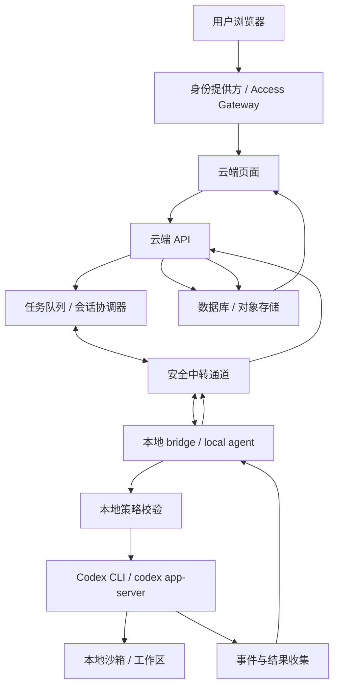
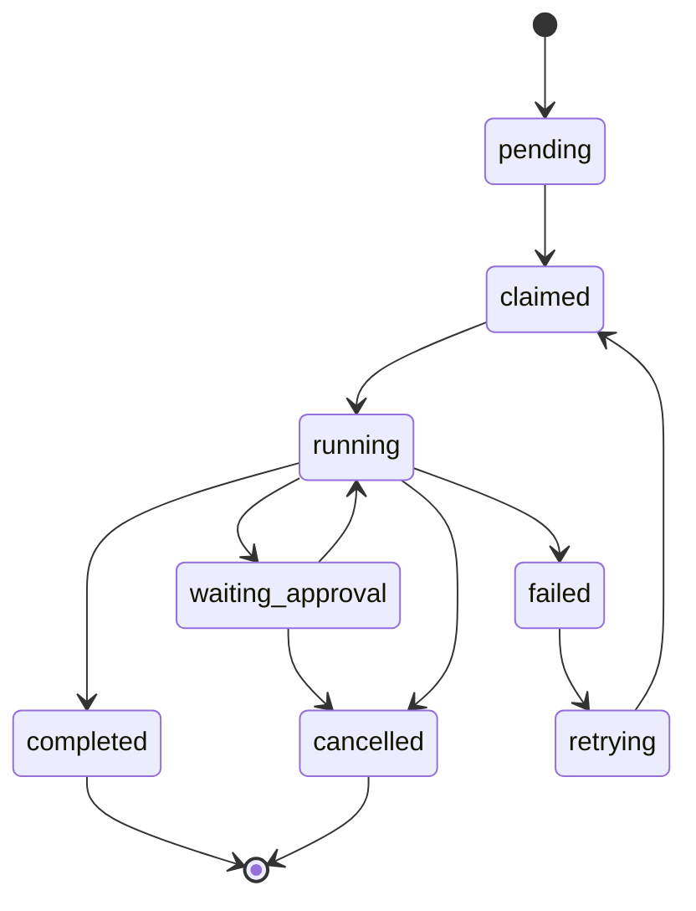

# 云端页面基于反向隧道的本地 Codex CLI 执行桥反馈云端

> 一个“云端控制、本地执行、结果回写”的私有自动化架构说明

**English:** Remote Web UI to Local Codex CLI Execution Bridge via Reverse Tunnel  
**中文技术名：** 基于反向隧道的本地 Codex CLI 执行桥：从云端页面到本地执行再回写云端

<details>
<summary><strong>English Summary</strong></summary>

This document describes a private cloud-to-local Codex execution bridge pattern.

The cloud side acts as the control plane: it handles identity, task creation, state tracking, logs, and result display. The local side acts as the execution plane: a local bridge receives tasks, validates policy, runs Codex in an allowlisted workspace, and sends results back to the cloud.

The key boundary is:

```text
The cloud can request work.
The local bridge decides what is allowed to execute.
```

This architecture is suitable for private, single-user, self-hosted systems. It is not intended as a public API proxy, an account-sharing mechanism, or a way to bypass usage limits, billing systems, rate limits, or safety mechanisms.

Implementation can be platform-agnostic. Cloudflare is one possible stack, but the same responsibilities can be mapped to Vercel, Supabase, AWS, GCP, Azure, a VPS, or a custom backend.

For a first proof of concept, the safest minimal flow is signed polling plus `codex exec`: the cloud creates a task, the local bridge validates it, Codex runs locally in a constrained workspace, and logs/results are returned to the cloud. Even a private prototype should include task IDs, nonce/expiry checks, workspace allowlists, sandboxing, timeouts, output limits, log redaction, and audit trails.

</details>

这套架构的核心不是让云端页面直接运行 Codex，而是把云端页面作为控制面，把用户自己的本地机器作为执行面，再用反向隧道或安全中转通道把两者连接起来。用户在云端页面输入任务，云端负责鉴权、排队、状态记录和结果展示；本地 bridge 收到任务后调用本机 Codex CLI 或 `codex app-server` 执行，再把日志、状态、结构化输出和产物回写到云端数据库。

## 架构摘要

这是一种私有自托管执行器模式。它的工程形态接近 GitHub Actions self-hosted runner、Cloudflare Tunnel、Tailscale、ngrok、本地 IDE agent 和 Web 控制台的组合。

关键判断：

- 云端页面是控制入口，不是 CLI 执行环境。
- 云端 API 是任务控制面，负责鉴权、排队、状态和审计。
- 本地 bridge 是执行代理，负责接收任务、校验策略、调用 Codex。
- Codex CLI 在本地项目目录内运行，受 sandbox、工作区白名单和审批策略约束。
- 执行结果回写云端，供网页展示、检索和归档。

## 适用边界

适用场景：

- 个人私有系统。
- 单一账号远程控制自己的本地开发环境。
- 云端页面触发本地 Codex 执行开发、分析、修复、报告生成等任务。
- 本地机器不暴露公网端口，由本地 bridge 主动连接云端。
- 任务执行受工作区、命令、审批、超时和审计约束。
- 云端控制面运行在 Cloudflare、Vercel、Supabase、AWS、GCP、Azure、自建 VPS 等任意平台。

不适用场景：

- 面向公众用户开放。
- 多人共享同一个个人 Codex 登录态。
- 把个人订阅包装成对外 AI API。
- 允许网页向本地机器透传任意 shell 命令。
- 让本地 Codex 默认访问整个用户目录、密钥、浏览器缓存或 SSH 凭据。

合规叙事应保持清晰：这不是“云端代理订阅额度”，而是“远程使用自己的本地开发环境”。一旦变成多人共享、对外售卖或规避官方限制，风险边界会明显改变。

## 完整链路

```text
用户浏览器
  -> 云端网页
  -> 身份提供方 / Access Gateway
  -> 云端 API / 任务队列
  -> 安全中转通道
  -> 本地 bridge / local agent
  -> Codex CLI 或 codex app-server
  -> 本地沙箱 / 本地项目目录执行
  -> 本地 bridge 收集结果
  -> 云端 API
  -> 云端数据库 / 对象存储
  -> 云端网页展示结果
```

链路里的“codex server 执行”需要拆开理解：

- `codex exec`：本地 CLI 的一次性非交互任务执行方式。
- `codex app-server`：本地 Codex 服务协议，更适合富客户端和多轮交互。
- OpenAI 云端服务：模型推理与 Codex 背后的能力提供方，不等同于本地 `codex app-server`。

Serverless 函数、边缘函数或静态网页不承担本地 CLI 执行职责。真正运行 `codex` 的环境必须是本地电脑、VPS、私有服务器、CI runner 或容器。

## 架构图



## 组件职责

### 云端页面

云端页面是用户入口，负责：

- 登录状态展示。
- 任务输入。
- 任务历史。
- 执行进度展示。
- 日志流展示。
- 结果查看。
- 人工审批按钮。

网页不持有 OpenAI API Key，不直接暴露本地 bridge 地址，也不直接下发 shell 命令。网页只调用云端 API。

### 云端 API / 控制面

云端 API 是控制中心，负责：

- 校验身份提供方或访问网关传来的用户身份。
- 创建任务并分配 `task_id`。
- 写入任务状态。
- 向本地 bridge 下发任务。
- 接收本地 bridge 回传事件。
- 管理任务状态流转。
- 写入审计日志。
- 对任务、事件、产物做持久化。

## 平台映射

这个架构不绑定 Cloudflare。Cloudflare 是一个很适合个人私有系统的实现选项，但不是唯一实现方式。

| 职责 | 通用组件 | Cloudflare 实现 | 其他实现 |
| --- | --- | --- | --- |
| 身份校验 | IdP / Access Gateway | Cloudflare Access | Auth0、Clerk、Supabase Auth、GitHub OAuth、自建登录 |
| 云端页面 | Web UI | Cloudflare Pages | Vercel、Netlify、自建 Nginx、静态站点托管 |
| 控制面 API | API / Serverless / Backend | Cloudflare Worker | Next.js API、FastAPI、Express、AWS Lambda、Cloud Run、自建服务 |
| 任务协调 | Queue / Session Coordinator | Durable Objects、Queues | Redis、Postgres、SQS、Pub/Sub、RabbitMQ、SQLite |
| 长连接中转 | Relay / WebSocket Server | Durable Objects、Cloudflare Tunnel | Fly.io、Railway、Render、VPS、Tailscale、SSH reverse tunnel |
| 数据存储 | DB / Object Storage | D1、KV、R2 | Postgres、Supabase、S3、MinIO、SQLite、MySQL |

因此，“Cloudflare 版”只是一个参考落地：

- Cloudflare Access：单账号登录保护。
- Cloudflare Worker：轻量 API 和鉴权入口。
- Durable Objects：长连接、任务会话、单用户协调。
- D1 / KV / R2：任务、日志、结果和附件存储。
- Queues：异步任务分发。

“Vercel / Supabase 版”也可以成立：

- Vercel：页面和 API route。
- Supabase Auth：身份校验。
- Supabase Postgres：任务、日志和状态。
- Supabase Realtime 或独立 WebSocket relay：本地 bridge 通道。
- S3 / R2 / Supabase Storage：产物存储。

“自建 VPS 版”也可以成立：

- Nginx / Caddy：HTTPS 和反向代理。
- Express / FastAPI：控制面 API。
- Postgres / SQLite：任务数据库。
- WebSocket server：本地 bridge 中转。
- systemd：部署云端 relay 和本地 bridge。

### 安全中转通道

中转通道负责让云端控制面和本地执行面安全通信。更稳的模式是本地 bridge 主动连出：

```text
本地 bridge -> 主动连接 -> 云端 relay / WebSocket / Durable Object
```

这种反向连接模式避免本地机器暴露公网端口，也更容易穿透 NAT 和家庭网络。

实现形态：

- WebSocket 长连接。
- Cloudflare Tunnel。
- Tailscale Tailnet。
- SSH reverse tunnel。
- ngrok。
- 自建 relay server。

### 本地 bridge / local agent

本地 bridge 是整个架构中权限最高、风险最高的组件。它连接云端指令和本地执行能力，因此必须按高权限服务设计。

职责：

- 向云端注册在线状态。
- 维持长连接或定时拉取任务。
- 校验任务来源、签名、时间戳和 `task_id`。
- 校验工作区白名单和命令策略。
- 将任务转换成 Codex CLI 调用。
- 捕获 stdout、stderr、JSONL 事件和产物。
- 处理取消、超时、审批和失败重试。
- 回传日志、状态、结果和结构化产物。

实现语言：

- Node.js。
- Rust。
- Go。
- Python。
- Windows Service / macOS LaunchAgent / Linux systemd service。

### Codex CLI / `codex exec`

一次性任务采用 `codex exec`：

```bash
codex exec --json --sandbox workspace-write "任务内容"
```

适配任务：

- 项目分析。
- Bug 修复。
- 文档生成。
- 报告总结。
- 自动化批处理。
- 结构化 JSON 输出。

默认策略：

- 使用 `workspace-write` sandbox。
- 固定工作目录。
- 限制输出大小。
- 设置超时时间。
- 保留人工审批。
- 记录完整事件日志。

`danger-full-access` 只应出现在完全隔离、完全可信、具备审计和回滚能力的环境中。

### `codex app-server`

交互式任务采用 `codex app-server`：

```bash
codex app-server
```

适配任务：

- 流式事件。
- 多轮对话。
- 工具调用过程展示。
- 审批交互。
- 富客户端集成。
- 类似云端 Codex UI 的体验。

`codex exec` 更像一次性命令，`codex app-server` 更像本地 Codex 后端服务。第一阶段落地通常从 `codex exec` 开始，稳定后再升级到 `codex app-server`。

## 数据流示例

```text
1. 用户在云端页面输入任务：
   “检查这个项目最近一次改动有没有风险，并给出修复建议。”

2. 云端 API 创建任务：
   task_id = 20260517-001
   status = pending

3. 本地 bridge 通过 WebSocket 或签名轮询收到任务。

4. 本地 bridge 执行策略检查：
   - 任务来源合法。
   - 时间戳未过期。
   - task_id 未重复。
   - 工作区在白名单内。
   - 命令不触发强制审批。

5. 本地 bridge 调用：
   codex exec --json --sandbox workspace-write "..."

6. Codex CLI 在本地项目目录内读取、分析、修改或生成输出。

7. 本地 bridge 收集事件：
   - 进程启动。
   - 模型输出。
   - 工具调用。
   - 命令执行。
   - 文件变更。
   - 错误信息。
   - 任务完成。

8. 本地 bridge 将事件回传云端 API。

9. 云端数据库保存：
   - 任务状态。
   - 执行日志。
   - 输出结果。
   - 文件变更摘要。
   - 产物链接。

10. 云端页面展示最终结果。
```

## 任务状态机



状态说明：

- `pending`：云端已创建任务，等待本地 bridge 领取。
- `claimed`：本地 bridge 已锁定任务。
- `running`：Codex 正在本地执行。
- `waiting_approval`：命令或文件操作等待人工批准。
- `completed`：任务完成并已回写结果。
- `failed`：任务失败，保留错误信息。
- `retrying`：任务进入重试。
- `cancelled`：用户或策略取消任务。

## 数据库结构

### `tasks`

```text
id
user_id
title
prompt
status
workspace_id
agent_id
created_at
claimed_at
started_at
completed_at
error_message
```

### `task_events`

```text
id
task_id
event_type
event_payload
sequence
created_at
```

### `local_agents`

```text
id
name
owner_user_id
status
last_seen_at
version
capabilities
allowed_workspaces
```

### `approvals`

```text
id
task_id
approval_type
command
risk_level
status
created_at
resolved_at
```

### `task_outputs`

```text
id
task_id
output_type
content
artifact_url
created_at
```

### `workspaces`

```text
id
name
local_path
policy
created_at
updated_at
```

## 威胁模型

| 风险 | 典型方式 | 后果 | 防护 |
| --- | --- | --- | --- |
| 未授权访问 | 云端页面被绕过或登录态泄露 | 远程触发本地执行 | IdP / Access Gateway、JWT 校验、二次高熵 token |
| 重放攻击 | 旧任务包重复提交 | 重复执行危险操作 | `task_id` 唯一、时间戳、签名、nonce |
| Prompt 注入 | 任务诱导 Codex 读取敏感文件 | 凭据或隐私泄露 | 工作区白名单、敏感路径黑名单、输出脱敏 |
| 任意命令执行 | 网页透传 shell 命令 | 本地机器被接管 | 命令策略、审批流、固定 runner、sandbox |
| 权限过大 | Codex 访问整个用户目录 | 本地文件泄露或误改 | 独立 OS 用户、容器、固定 cwd |
| 产物泄露 | 日志上传密钥或源码 | 云端数据库泄密 | 日志脱敏、对象存储权限隔离、最小保存 |
| 任务失控 | 长时间执行或无限输出 | 本地资源耗尽 | 超时、输出上限、并发限制、取消机制 |
| 账号边界不清 | 多人共用个人登录态 | 合规和账号风险 | 单人私用、团队场景改用 API Key 或企业授权 |

## 审批策略

以下动作进入人工审批：

- 删除、移动、覆盖大量文件。
- 执行部署、发布、推送、重置、回滚。
- 修改 `.env`、SSH、云服务配置、支付配置。
- 安装依赖或执行来自网络的脚本。
- 访问工作区之外的路径。
- 运行长时间任务或高资源任务。
- 发送邮件、调用支付、触发外部生产系统。

审批记录需要保存：

- 任务 ID。
- 命令内容。
- 风险等级。
- 请求时间。
- 批准或拒绝人。
- 执行结果。

## 本地策略文件

本地 bridge 应持有一个本地策略文件，避免所有权限都由云端决定。

```json
{
  "agentName": "my-local-codex-runner",
  "workspaces": [
    {
      "id": "personal-dashboard",
      "path": "E:/projects/personal-dashboard",
      "sandbox": "workspace-write",
      "allowCommands": ["npm test", "npm run lint", "git diff"],
      "requireApprovalPatterns": ["rm", "git reset", "npm publish", "wrangler deploy"]
    }
  ],
  "limits": {
    "maxConcurrentTasks": 1,
    "taskTimeoutSeconds": 1800,
    "maxOutputBytes": 5242880
  }
}
```

## MVP 开发路线

### Phase 1：签名轮询 + `codex exec`

目标：

- 跑通从云端页面创建任务到本地执行再回写云端的闭环。
- 使用签名轮询，降低长连接复杂度。
- 固定一个本地 workspace。
- 固定 sandbox 为 `workspace-write`。
- 禁止任意 shell 透传。

链路：

```text
身份提供方 / Access Gateway
  -> Web 页面
  -> 云端 API
  -> 数据库创建任务
  -> 本地 bridge 轮询任务
  -> codex exec --json
  -> bridge 回传事件
  -> 数据库保存结果
  -> Web 页面展示
```

### Phase 2：WebSocket + 实时日志

目标：

- 本地 bridge 常驻在线。
- 云端即时下发任务。
- 页面实时展示日志和状态。
- 支持取消任务。
- 支持输出大小限制和超时。

### Phase 3：`codex app-server` + 审批流 + artifacts

目标：

- 支持多轮交互。
- 展示工具调用过程。
- 引入人工审批。
- 保存 diff、截图、报告、JSON 结果等 artifacts。
- 支持多个 workspace 和多套策略。

## 最小代码结构

```text
cloud/
  api.ts
  session-coordinator.ts
  db.sql
  auth.ts
  tasks.ts

bridge/
  agent.ts
  codex-runner.ts
  policy.ts
  transport.ts
  redaction.ts

web/
  pages/tasks.tsx
  components/task-log.tsx
  components/approval-panel.tsx

shared/
  protocol.ts
  schemas.ts
```

模块职责：

- `cloud/api.ts`：云端 API 入口，可以对应 Worker、API route、Express、FastAPI 或 Lambda。
- `cloud/session-coordinator.ts`：任务会话协调器，可以对应 Durable Objects、Redis、Postgres 或 WebSocket relay。
- `cloud/tasks.ts`：任务创建、领取、状态更新。
- `bridge/agent.ts`：本地 bridge 主进程。
- `bridge/codex-runner.ts`：封装 `codex exec` 和 `codex app-server`。
- `bridge/policy.ts`：本地策略校验。
- `bridge/redaction.ts`：日志脱敏。
- `shared/protocol.ts`：云端和本地的消息协议。

## 本地 bridge 伪代码

```js
while (true) {
  const task = await fetchNextSignedTask();

  if (!task) {
    await sleep(2000);
    continue;
  }

  assertFresh(task.timestamp);
  assertSignature(task);
  assertWorkspaceAllowed(task.workspaceId);

  const workspace = resolveWorkspace(task.workspaceId);
  const approval = evaluateApprovalPolicy(task);

  if (approval.required) {
    await requestApproval(task.id, approval);
    continue;
  }

  const child = spawn("codex", [
    "exec",
    "--json",
    "--sandbox",
    "workspace-write",
    task.prompt,
  ], {
    cwd: workspace.path,
  });

  child.stdout.on("data", (chunk) => {
    sendEvent(task.id, "stdout", redact(chunk.toString()));
  });

  child.stderr.on("data", (chunk) => {
    sendEvent(task.id, "stderr", redact(chunk.toString()));
  });

  child.on("exit", (code) => {
    completeTask(task.id, code);
  });
}
```

生产实现还需要：

- 子进程清理。
- 取消信号。
- 超时控制。
- 输出截断。
- 并发锁。
- 本地队列。
- 断线重连。
- 幂等回传。
- 错误重试。
- 版本上报。

## 目标架构

```text
Browser
  -> Identity Provider / Access Gateway
  -> Web UI
  -> Cloud API
  -> Task session coordinator
  -> Database / Object Storage
  <- WebSocket / signed polling
Local Bridge
  -> Validate task
  -> Run Codex CLI in allowlisted workspace
  -> Stream JSONL events
  -> Upload result and artifacts
```

本地执行侧：

```text
Local Bridge
  -> Workspace policy
  -> Approval policy
  -> codex exec or codex app-server
  -> Sandbox
  -> Result collector
```

## 不适合做的事

- 将 bridge 暴露公网。
- 允许网页传任意 shell 命令。
- 允许多人共用个人 Codex 登录态。
- 将 `auth.json` 放到云端服务器。
- 做成对外售卖的 API。
- 让 Codex 默认拥有整个用户目录的访问权。
- 在没有人工审批的情况下执行部署、删除、重置、支付、发邮件等高风险动作。

## 结论

这套架构不是“云端运行 Codex”，而是“云端控制本地 Codex”。它不是公开 API，而是个人私有的自托管执行器。真正的工程难点不在通道，而在身份、权限、审计、审批、sandbox、日志脱敏和执行边界。

一句话总结：

**云端只做控制面，本地只做执行面，中间用反向隧道连接，所有任务都必须具备身份、权限、审计和边界。**

## 参考资料

- Codex Authentication: https://developers.openai.com/codex/auth
- Codex Non-interactive Mode: https://developers.openai.com/codex/noninteractive
- Codex App Server: https://developers.openai.com/codex/app-server
- OpenAI Account Sharing Policy: https://help.openai.com/en/articles/10471989
- OpenAI Terms of Use: https://openai.com/policies/terms-of-use/
