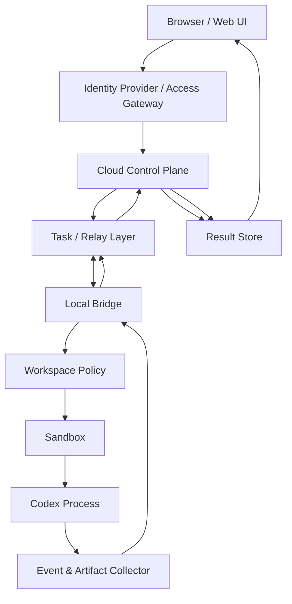

# Cloud-to-Local Codex Bridge

[中文](../zh/README.md) | [English](README.md)


Route tasks from a private cloud UI to a local Codex CLI runner, then send logs and results back to the cloud.

**Cloud-to-Local Codex Bridge** is a concept and architecture note for safely routing tasks from a private cloud UI to a local Codex CLI runner.

It describes a private, self-hosted execution pattern. The cloud side is the control plane: identity, task creation, state, logs, and result display. The local side is the execution plane: a local bridge receives tasks, validates policy, starts Codex in an allowlisted workspace, and sends results back.

## What It Is

This repository documents a **cloud-to-local execution bridge**:

```text
Web UI
  -> Cloud Control Plane
  -> Task / Relay Layer
  -> Local Bridge
  -> Local Codex Runtime
  -> Result Store
  -> Web UI
```

The local bridge is also understandable as a local agent or private runner. It connects outward to the cloud side, checks whether a task is allowed, then runs Codex locally through `codex exec` or, for richer interactive flows, `codex app-server`.

The core idea is simple: **the cloud can request work, but the local bridge decides what is allowed to execute.**

## What It Is Not

This project is not a public API proxy.

This project is not intended for account sharing.

This project is not a way to bypass usage limits, billing systems, rate limits, or safety mechanisms.

This project is not an official OpenAI project or policy interpretation.

It is a private self-hosted runner pattern for a single user controlling their own local machine.

## 30-Second Model

Most cloud AI apps look like this:

```text
browser -> cloud API -> model service -> browser
```

This pattern looks like this:

```text
browser -> cloud control plane -> local bridge -> local Codex process -> cloud result view
```

Key points:

- The browser does not run Codex.
- The cloud control plane does not directly enter the local machine.
- The local bridge connects outward, validates the task, runs Codex in a controlled workspace, and returns logs/results.

## Architecture Overview

Read the diagram from top to bottom. A task starts in the browser, moves through the cloud control plane, is picked up by the local bridge, runs in a local workspace, then returns to the cloud result view.



## Scope And Boundaries

This architecture is suitable for:

- Private personal systems.
- A single user controlling their own local development workspace.
- A cloud UI that starts local Codex tasks without exposing a local public port.
- Platform-agnostic deployments on Cloudflare, Vercel, Supabase, AWS, GCP, Azure, a VPS, or a custom backend.
- Systems where execution is constrained by workspace policy, sandboxing, approval, timeout, output limits, and audit logs.

This architecture is not suitable for:

- Public multi-user access.
- Sharing one personal Codex or ChatGPT login across users.
- Reselling or wrapping a personal subscription as a public API.
- Passing arbitrary shell commands from a web page to a local machine.
- Letting Codex access the entire user directory, SSH keys, browser cookies, cloud credentials, `.env` files, or token caches by default.

## Platform-Agnostic Mapping

Cloudflare is one possible implementation, not a requirement. The same responsibilities can be mapped to many platforms.

| Responsibility | Generic Component | Example Implementations |
| --- | --- | --- |
| Identity | IdP / access gateway | Cloudflare Access, Auth0, Clerk, Supabase Auth, GitHub OAuth |
| Web UI | Frontend hosting | Cloudflare Pages, Vercel, Netlify, static hosting |
| Control plane | API / backend | Cloudflare Worker, Next.js API routes, FastAPI, Express, Lambda, Cloud Run |
| Task coordination | Queue / state store | Durable Objects, Redis, Postgres, SQS, Pub/Sub, RabbitMQ |
| Relay / transport | Polling, WebSocket, SSE, tunnel, mesh network | WebSocket server, Tailscale, SSH reverse tunnel, VPS relay |
| Result storage | Database / object storage | Postgres, SQLite, Supabase, D1, S3, R2, MinIO |

## Minimal Viable Flow

The first prototype does not need a full interactive runtime. A minimal version can use signed polling and `codex exec`:

```text
1. Cloud UI creates a task
2. Cloud API stores the task as pending
3. Local bridge polls for pending work
4. Local bridge verifies signature, expiry, nonce, workspace, and risk policy
5. Local bridge runs codex exec in an allowlisted workspace
6. Local bridge redacts/truncates logs and uploads events
7. Cloud UI displays completed or failed status
```

Even a private proof of concept should include:

- `task_id`, `nonce`, and `expires_at`
- workspace allowlist
- sandbox enabled by default
- output-size limit
- timeout and cancellation
- log redaction
- replay protection
- auditable task state

## Roadmap

**Phase 1: signed polling + `codex exec`**

Build the smallest safe loop: create task, local bridge claims it, Codex runs locally, result returns to cloud.

**Phase 2: real-time events + cancellable execution**

Add live logs, ordered events, timeout handling, cancellation, and idempotent result updates.

**Phase 3: approvals + artifacts + audit**

Add human approval for risky operations, persist artifacts such as diffs and reports, redact logs, and keep a full audit trail.

**Phase 4: session runtime**

Explore `codex app-server`, multi-workspace policies, richer interaction, and long-lived sessions.

## Security Boundaries

The cloud side should not be blindly trusted by the local bridge. The cloud can submit a task request, but local execution must remain locally governed.

Required guardrails:

- Do not upload local auth files such as `~/.codex/auth.json`, API keys, SSH keys, browser cookies, cloud credentials, `.env` files, or token caches.
- Do not expose the local bridge directly to the public internet.
- Do not allow arbitrary shell command passthrough from the web page.
- Do not run with full user-directory access by default.
- Do not share a personal Codex login session with other users.
- Keep local policy local: workspace allowlists, risk rules, and approval decisions must be enforced by the bridge.
- Store only the minimum task data needed, and redact sensitive logs before upload.

See [SECURITY.md](../../SECURITY.md) for the threat model and implementation checklist.

## Repository Status

Status: **concept / architecture note**

Runnable code: **not yet**

Primary output:

- architecture overview
- security boundaries
- platform mapping
- MVP roadmap
- implementation notes

This repository intentionally starts as documentation. A proof of concept can be added later without changing the core boundary: **cloud control plane, local execution plane**.

## Repository Structure

```text
README.md              # Language entry and repository overview
docs/README.md         # Documentation index
docs/zh/README.md      # 中文 README
docs/en/README.md      # English README
docs/architecture.md   # Full architecture note, currently in Chinese
SECURITY.md            # Threat model and security checklist
DISCLAIMER.md          # Scope and usage disclaimer
CONTRIBUTING.md        # Contribution guidelines
.gitignore
```

## How To Read This Repository

- Start from [README.md](../../README.md) to choose a language.
- Read [docs/architecture.md](../architecture.md) for the full architecture note.
- Read [SECURITY.md](../../SECURITY.md) before building a proof of concept.
- Read [DISCLAIMER.md](../../DISCLAIMER.md) before adapting the idea for teams, public users, or commercial services.
- Read [CONTRIBUTING.md](../../CONTRIBUTING.md) before opening issues or proposing changes.

## FAQ

### Is this Cloudflare-specific?

No. Cloudflare is one possible implementation. The same pattern can be built with Vercel, Supabase, AWS, GCP, Azure, a VPS, or a custom backend.

### Can a cloud web page directly run Codex CLI?

No. A browser cannot directly run a user's local CLI. Running a CLI in the cloud also does not give it the user's local project, credentials, shell environment, or files. That is why the local bridge exists.

### Why should the local bridge connect outward?

An outbound bridge avoids exposing a local public port. It also keeps the final execution decision on the local side, where workspace policy and approval rules can be enforced.

### Why not send shell commands from the web page?

That would turn the web UI into a remote command execution surface. The safer pattern is task-based execution with local policy checks, sandboxing, output limits, and approval for risky actions.

### Is there runnable code here?

Not yet. This repository currently documents the architecture. Future additions may include platform examples, a local bridge proof of concept, and protocol sketches.

## References

Codex documentation:

- [Codex Authentication](https://developers.openai.com/codex/auth)
- [Codex Non-interactive Mode](https://developers.openai.com/codex/noninteractive)
- [Codex App Server](https://developers.openai.com/codex/app-server)

Policy and account-boundary references:

- [OpenAI Account Sharing Policy](https://help.openai.com/en/articles/10471989)
- [OpenAI Terms of Use](https://openai.com/policies/terms-of-use/)

Specific CLI flags and product behavior may change over time. Treat this repository as an architecture note, and use current official documentation for implementation details.
