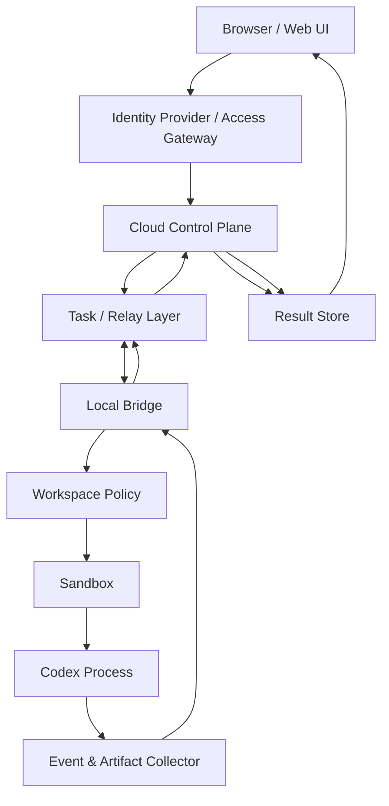

# Cloud-to-Local Codex Bridge

[中文](README.md) | [English](../en/README.md)


云端发任务，本地 Codex 执行，结果回写云端。

**Cloud-to-Local Codex Bridge** 是一份 concept / architecture note，用来描述如何把私有云端页面里的任务安全地交给本地 Codex CLI runner 执行。

它描述的是一种私有、自托管的执行模式。云端侧是 control plane：负责身份、任务创建、状态、日志和结果展示。本地侧是 execution plane：本地 bridge 接收任务、校验策略、在允许列表工作区里启动 Codex，并把结果回传云端。

## What It Is

这个仓库记录的是一个 **cloud-to-local execution bridge**：

```text
Web UI
  -> Cloud Control Plane
  -> Task / Relay Layer
  -> Local Bridge
  -> Local Codex Runtime
  -> Result Store
  -> Web UI
```

本地 bridge 也可以理解为 local agent 或 private runner。它主动连接云端，检查任务是否允许执行，然后通过 `codex exec` 在本地运行 Codex；如果要做更丰富的交互式流程，也可以进一步研究 `codex app-server`。

核心原则很简单：**云端可以请求执行任务，但本地 bridge 必须决定什么任务允许执行。**

## What It Is Not

这个项目不是公开 API proxy。

这个项目不用于 account sharing。

这个项目不是绕过 usage limits、billing systems、rate limits 或 safety mechanisms 的方法。

这个项目不是 OpenAI 官方项目，也不是 OpenAI policy interpretation。

它描述的是单用户、私有、自托管的 runner pattern：用户远程控制自己的本地机器。

## 30 秒理解

常见云端 AI app 大致是：

```text
browser -> cloud API -> model service -> browser
```

这个模式是：

```text
browser -> cloud control plane -> local bridge -> local Codex process -> cloud result view
```

关键点：

- Browser 不运行 Codex。
- Cloud control plane 不直接进入本地机器。
- Local bridge 主动连出、校验任务、在受控 workspace 中运行 Codex，并回传 logs/results。

## Architecture Overview

从上往下读这张图：任务从浏览器开始，经过 cloud control plane，被 local bridge 领取，在本地 workspace 中运行，然后回到云端结果页。



## Scope And Boundaries

适合：

- 个人私有系统。
- 单用户控制自己的本地开发 workspace。
- 云端 UI 启动本地 Codex 任务，同时不暴露本地公网端口。
- 部署在 Cloudflare、Vercel、Supabase、AWS、GCP、Azure、VPS 或自建 backend 上。
- 执行受 workspace policy、sandbox、approval、timeout、output limits 和 audit logs 约束。

不适合：

- 公开多用户访问。
- 多人共享一个个人 Codex 或 ChatGPT 登录态。
- 把个人订阅包装成 public API。
- 从网页向本地机器透传任意 shell commands。
- 让 Codex 默认访问整个用户目录、SSH keys、browser cookies、cloud credentials、`.env` files 或 token caches。

## Platform-Agnostic Mapping

Cloudflare 是一种实现选项，不是要求。同一组职责也可以映射到其他平台。

| Responsibility | Generic Component | Example Implementations |
| --- | --- | --- |
| Identity | IdP / access gateway | Cloudflare Access, Auth0, Clerk, Supabase Auth, GitHub OAuth |
| Web UI | Frontend hosting | Cloudflare Pages, Vercel, Netlify, static hosting |
| Control plane | API / backend | Cloudflare Worker, Next.js API routes, FastAPI, Express, Lambda, Cloud Run |
| Task coordination | Queue / state store | Durable Objects, Redis, Postgres, SQS, Pub/Sub, RabbitMQ |
| Relay / transport | Polling, WebSocket, SSE, tunnel, mesh network | WebSocket server, Tailscale, SSH reverse tunnel, VPS relay |
| Result storage | Database / object storage | Postgres, SQLite, Supabase, D1, S3, R2, MinIO |

## Minimal Viable Flow

第一版不需要完整的 interactive runtime。最小版本可以用 signed polling 和 `codex exec`：

```text
1. Cloud UI creates a task
2. Cloud API stores the task as pending
3. Local bridge polls for pending work
4. Local bridge verifies signature, expiry, nonce, workspace, and risk policy
5. Local bridge runs codex exec in an allowlisted workspace
6. Local bridge redacts/truncates logs and uploads events
7. Cloud UI displays completed or failed status
```

即使是私有 PoC，也应该包含：

- `task_id`, `nonce`, `expires_at`
- workspace allowlist
- sandbox enabled by default
- output-size limit
- timeout and cancellation
- log redaction
- replay protection
- auditable task state

## Roadmap

**Phase 1: signed polling + `codex exec`**

跑通最小安全闭环：创建任务，本地 bridge 领取任务，本地 Codex 执行，结果返回云端。

**Phase 2: real-time events + cancellable execution**

加入 live logs、ordered events、timeout handling、cancellation 和 idempotent result updates。

**Phase 3: approvals + artifacts + audit**

加入高风险操作审批，保存 diff、reports 等 artifacts，做 log redaction，并保留完整 audit trail。

**Phase 4: session runtime**

探索 `codex app-server`、多 workspace policy、更丰富的交互和 long-lived sessions。

## Security Boundaries

Cloud side 不应该被 local bridge 盲信。云端可以提交 task request，但本地执行必须由本地策略治理。

必要 guardrails：

- 不上传本地 auth files，例如 `~/.codex/auth.json`、API keys、SSH keys、browser cookies、cloud credentials、`.env` files 或 token caches。
- 不把 local bridge 直接暴露到公网。
- 不允许网页透传任意 shell command。
- 默认不使用 full user-directory access。
- 不多人共享个人 Codex login session。
- 本地策略必须留在本地：workspace allowlists、risk rules、approval decisions 都必须由 bridge 强制执行。
- 只保存必要任务数据，敏感 logs 上传前先 redaction。

完整威胁模型见 [SECURITY.md](../../SECURITY.md)。

## Repository Status

Status: **concept / architecture note**

Runnable code: **not yet**

Primary output:

- architecture overview
- security boundaries
- platform mapping
- MVP roadmap
- implementation notes

这个仓库先从文档开始。后续可以加入 proof of concept，但核心边界不变：**cloud control plane, local execution plane**。

## Repository Structure

```text
README.md              # Language entry and repository overview
docs/README.md         # Documentation index
docs/zh/README.md      # 中文 README
docs/en/README.md      # English README
docs/architecture.md   # Full architecture note, currently in Chinese
SECURITY.md            # Threat model and security checklist
DISCLAIMER.md          # Scope and usage disclaimer
CONTRIBUTING.md        # Contribution guidelines
.gitignore
```

## How To Read This Repository

- 从 [README.md](../../README.md) 进入语言目录。
- 读 [docs/architecture.md](../architecture.md) 查看完整架构说明。
- 做 PoC 之前先读 [SECURITY.md](../../SECURITY.md)。
- 面向团队、公开用户或商业服务前先读 [DISCLAIMER.md](../../DISCLAIMER.md)。
- 提 issue 或改文档前先读 [CONTRIBUTING.md](../../CONTRIBUTING.md)。

## FAQ

### 这个方案只能用 Cloudflare 吗？

不是。Cloudflare 只是一个实现选项。同样的 pattern 可以用 Vercel、Supabase、AWS、GCP、Azure、VPS 或自建 backend 实现。

### 云端网页能直接运行 Codex CLI 吗？

不能。Browser 不能直接运行用户本地 CLI。在云端运行 CLI 也不会拥有用户本地项目、凭据、shell environment 或 files，所以它不是同一个 execution plane。

### 为什么 local bridge 要主动连出？

Outbound bridge 可以避免暴露本地公网端口，也能把最终执行决策留在本地侧，由 workspace policy 和 approval rules 强制执行。

### 为什么不能从网页直接发送 shell commands？

那会把 Web UI 变成 remote command execution surface。更安全的模式是 task-based execution，加上本地 policy checks、sandboxing、output limits 和 approval。

### 现在有可运行代码吗？

还没有。这个仓库当前是 architecture note。未来可以加入 platform examples、local bridge proof of concept 和 protocol sketches。

## References

Codex documentation:

- [Codex Authentication](https://developers.openai.com/codex/auth)
- [Codex Non-interactive Mode](https://developers.openai.com/codex/noninteractive)
- [Codex App Server](https://developers.openai.com/codex/app-server)

Policy and account-boundary references:

- [OpenAI Account Sharing Policy](https://help.openai.com/en/articles/10471989)
- [OpenAI Terms of Use](https://openai.com/policies/terms-of-use/)

具体 CLI flags 和 product behavior 可能变化。这个仓库描述 architecture pattern，实际实现请以当前官方文档为准。
